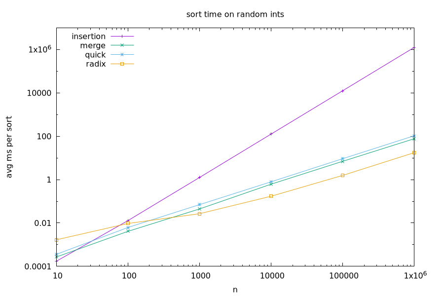

# Assignment 4: Sorting

Four sorts: insertion, merge, quick, radix. Each one is a header file, `Test.cpp` has some quick unit tests, `Benchmark.cpp` does the timing and the plot.

## Complexity

**Insertion sort**:

The best case is O(n), when the input is already sorted and the inner loop stops right away for every element. The worst case is O(n^2), when the input is reverse sorted and element i has to move back i spots. On random input each element moves back about half way, which is still O(n^2). It only swaps elements inside arr, so the extra space is O(1).

**Merge sort**:

The time is Theta(nlogn) for every input. Splitting in half gives logn levels, and merging all the pieces on same level touches n elements, so T(n) = 2T(n/2) + n. The extra space is O(n) because the original array is copied into the left and right arrays.

**Quick sort**:

The pivot I use is arr[0], smaller-or-equal elements go to small and bigger ones go to large. The average case is O(nlogn), when the input is random and the pivot is roughly the median. Then each split is about half and half, giving log n levels of n work each, so T(n) = 2T(n/2) + n. The worst case is O(n^2), which happens on sorted, reverse sorted, or all-equal input. There the pivot is always the min or max, so one side is empty and the other only shrinks by 1. That means n levels and n + (n-1) + ... + 1 work in total, so T(n) = T(n-1) + n. The extra space is O(n) on average for small and large, but O(n^2) in the worst case, since every level keeps its copy alive until it returns. The worst case also recurses n deep.

**Radix sort**:

Only works for non-negative ints. The time is O(d*n), where d is the number of digits in the largest number. Each iteration drops all n numbers into 10 buckets and reads them back, and there is one pass per digit. Since d is about log10(m) for values up to m, this is O(nlogm). The extra space is O(n + 10) for the buckets.

## Benchmark setup

- Input: random ints from 0 to 1,000,000.
- Sizes: 10, 100, 1k, 10k, 100k, 1M.
- Trials per size: 1000, 1000, 100, 20, 10, 5. Small sizes run more since one sort takes under a microsecond and is hard to time alone.
- Except insertion sort: only 3 trials at 100k and 1 at 1M. One 1M run already takes ~21 min. Otherwise it would take too long.
- All four sorts get the same arrays for a given size. Copies are made before the timer starts.
- The whole batch is timed once and divided by the number of trials.
- I compiled my code with  the parameter `-O2` which optimizes the compiling process for efficiency test. (My first run used the VS Code default build with no optimization, and merge/quick/radix were 3-5x slower.)
- Machine: My Olin Laptop.

## Results

Average ms per sort (raw numbers in [results.csv](results.csv)):

| n         | insertion | merge   | quick   | radix  |
| --------- | --------- | ------- | ------- | ------ |
| 10        | 0.00017   | 0.00027 | 0.00036 | 0.0017 |
| 100       | 0.013     | 0.0041  | 0.0062  | 0.0095 |
| 1,000     | 1.25      | 0.044   | 0.070   | 0.027  |
| 10,000    | 125       | 0.61    | 0.79    | 0.17   |
| 100,000   | 12,474    | 6.97    | 9.20    | 1.56   |
| 1,000,000 | 1,247,190 | 76.7    | 105     | 17.5   |

## Analysis

The growth matches the complexity. Every time n goes up 10x, insertion sort goes up exactly about 100x, which is n^2. Merge and quick go up about 11-12x, which is what n log n predicts (10x for n, plus a bit more from log n). Radix goes up about 10x, so it's basically linear here, because the values are capped at 1,000,000 and there are never more than 7 passes no matter how big n gets. On the log-log plot this shows up as slope: insertion's line is about twice as steep as the others.

Interestingly small n is a different story. At n = 10 insertion sort is the fastest and radix is the slowest. Insertion has no "overhead", which is the extra cost except compare and swap, at all, while merge and quick allocate new vectors at every level, and radix still does 7 passes with 10 buckets each even for 10 numbers. By n = 100 insertion is already the slowest, and from n = 1000 on radix is the fastest. At 1M radix is ~8x faster than merge, and insertion is ~10000x slower than merge.

Merge and quick are both n log n, but quick is consistently about 1.3-1.5x slower. My guess is that `small` and `large` grow with `push_back` and get reallocated several times, while merge's `left` and `right` are created at the right size in one go. 

## Limitations

- Every test array was random numbers. I didn't try sorted, reverse sorted, or all-equal arrays, so quick sort's O(n^2) worst case and insertion sort's O(n) best case never show up here.
- Insertion at 1M is a single run, so that number might not be very precise.
- Radix sort only handles non-negative integers.
